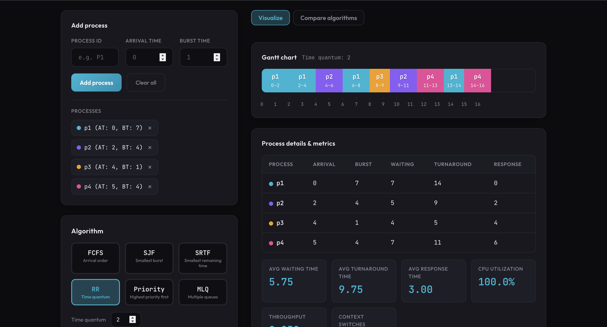
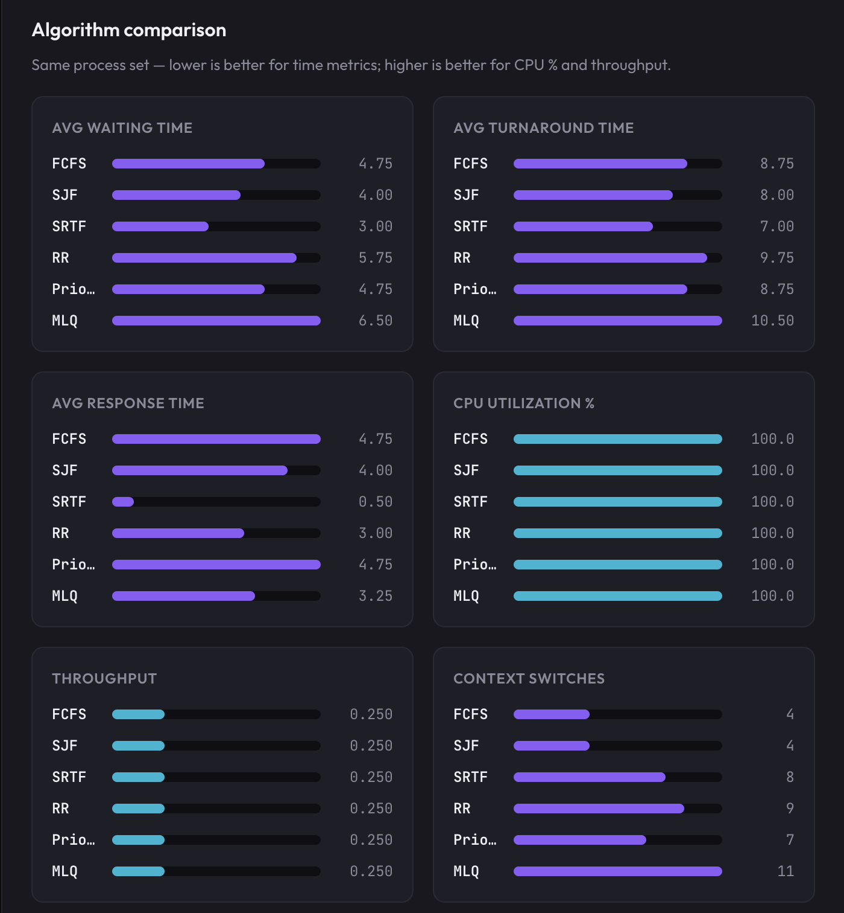

# 🚀 CPU Scheduling Visualizer

🔗 **Live Demo:**  
👉 https://cpu-scheduling-visualizer-drab.vercel.app/

A production-style **React + Vite** application that simulates and compares multiple CPU scheduling algorithms, visualizes execution using dynamic Gantt charts, and computes full Operating System performance metrics.

This project bridges theoretical OS scheduling concepts with interactive visualization and measurable system performance analysis.

---

# 📌 Problem Relevance to Operating Systems

CPU Scheduling is one of the most fundamental responsibilities of an Operating System.

The scheduler determines:

- Which process runs next
- How long it runs
- Whether it can be preempted
- How efficiently CPU time is utilized
- How many context switches occur

This project simulates real scheduling behavior and evaluates how different algorithms impact:

- Waiting Time
- Turnaround Time
- Response Time
- CPU Utilization
- Throughput
- Context Switching Overhead

It transforms abstract OS theory into measurable, visual system behavior.

---

# 🎯 Objectives

The primary goals of this project are:

1. Implement multiple CPU scheduling algorithms correctly.
2. Visualize process execution using an interactive Gantt chart.
3. Compute complete OS performance metrics.
4. Compare algorithms using the same process set.
5. Demonstrate differences between preemptive and non-preemptive scheduling.
6. Maintain clean, modular, and scalable architecture.

---

# 🧠 Algorithms Implemented

| Algorithm | Type | Description |
|------------|------------|-------------|
| **FCFS** | Non-Preemptive | First-Come First-Served — executes in arrival order |
| **SJF** | Non-Preemptive | Shortest Job First — smallest burst selected |
| **SRTF** | Preemptive | Shortest Remaining Time First |
| **Round Robin** | Preemptive | Time quantum-based scheduling |
| **Priority Scheduling** | Configurable | Highest priority first (preemptive toggle supported) |
| **Multilevel Queue (MLQ)** | Mixed | Q0: RR (TQ=2), Q1: RR (TQ=4), Q2: FCFS |

---

# 📊 Performance Metrics Calculated

For each algorithm, the system computes:

- Waiting Time
- Turnaround Time
- Response Time
- Average Waiting Time
- Average Turnaround Time
- Average Response Time
- CPU Utilization (%)
- Throughput
- Context Switch Count

All metrics are derived from the actual simulation logic of the scheduler.

---

# ✨ Features

## 🔹 Process Input

- Process ID (PID)
- Arrival Time
- Burst Time
- Priority (for Priority Scheduling)
- Queue Level (for Multilevel Queue)

---

## 🔹 Gantt Chart Visualization

- Color-coded execution blocks
- Idle time visualization
- Time axis rendering
- Preemption transitions visible
- Animated hover effects
- Responsive layout

---

## 🔹 Process Metrics Table

Displays per-process:

- Arrival Time
- Burst Time
- Waiting Time
- Turnaround Time
- Response Time

---

## 🔹 Algorithm Comparison Mode

Runs all algorithms on the same process set and compares:

- Average Waiting Time
- Average Turnaround Time
- Average Response Time
- CPU Utilization
- Throughput
- Context Switches

Bar charts visually highlight performance differences.

---

# 🏗️ Code Structure & Modularity
```bash
src/
│
├── components/
│ ├── ProcessInput.jsx
│ ├── GanttChart.jsx
│ ├── ProcessTable.jsx
│ ├── AlgorithmSelector.jsx
│ ├── ComparisonChart.jsx
│ └── ConceptsCard.jsx
│
├── utils/
│ ├── algorithms.js
│ ├── metrics.js
│ └── constants.js
│
├── App.jsx
├── main.jsx
└── index.css
```


### Design Principles

- Clear separation of UI and scheduling logic
- Reusable scheduling engine
- Dedicated metrics computation module
- Independent algorithm implementations
- Scalable structure for adding new algorithms

---

# ⚙️ Implementation Details

## Non-Preemptive Scheduling

- Process selected based on arrival and criteria
- Runs to completion
- Idle time handled explicitly

## Preemptive Scheduling

- Time simulated unit-by-unit
- Ready queue updated dynamically
- Remaining burst time tracked
- Context switches counted accurately

## Multilevel Queue

- Fixed queue priority hierarchy
- Different scheduling policies per queue
- Lower queues execute only when higher queues are empty

---

# 📦 Installation & Running

```bash
npm install
npm run dev
```

Open:
http://localhost:5173

# 🏗️ Build for Production
```bash
npm run build
npm run preview
```

---

# 📌 Current Implementation Status

- ✔ Six algorithms fully implemented  
- ✔ Preemptive and non-preemptive scheduling supported  
- ✔ Full performance metrics calculation  
- ✔ Interactive Gantt chart  
- ✔ Algorithm comparison mode  
- ✔ Context switch tracking  
- ✔ Modular architecture  

---

# 🧪 Academic Value

This project serves as:

- A practical demonstration of CPU scheduling theory  
- A performance analysis tool  
- A teaching and learning utility  
- A foundation for advanced scheduling research  

---

# 👩‍💻 Tech Stack

- React  
- Vite  
- JavaScript (ES6+)  
- CSS Modules  

---

# 📸 Screenshots





# 🏁 Conclusion

The CPU Scheduling Visualizer transforms theoretical Operating System scheduling concepts into an interactive, measurable, and visually intuitive system, enabling deeper understanding of how scheduling decisions directly impact overall system performance.